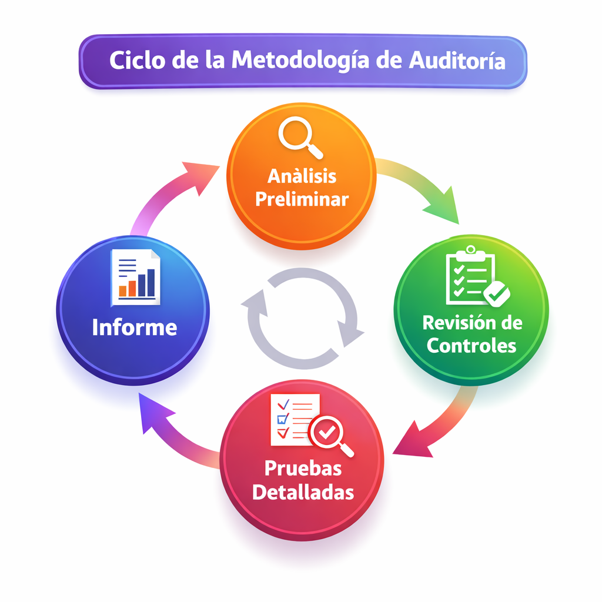
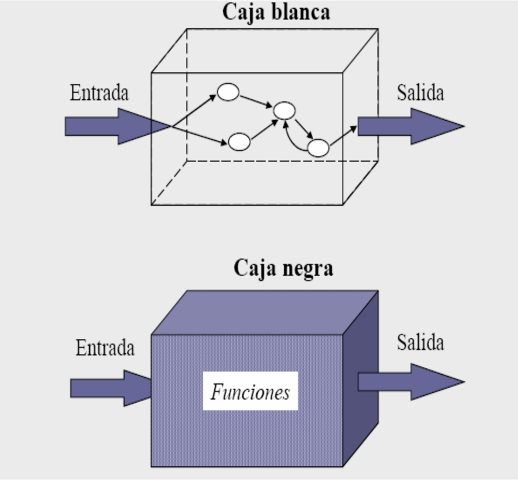

  
  <h1 style="margin: 0; line-height: 1.2;">Unidad 4: Auditoría Informática</h1>

Bienvenido a este blog de evaluación. A continuación, se desarrolla el contenido correspondiente a la metodología, planificación y ejecución de pruebas en el entorno de la auditoría de sistemas.

---

## 1. Metodología y Planificación de la AI

### Metodología
La Auditoría Informática (AI) no es un proceso aleatorio; requiere un enfoque sistemático. La metodología general incluye:
1.  **Análisis preliminar:** Entender el negocio y el entorno TI.
2.  **Revisión de controles:** Verificar qué medidas de seguridad existen.
3.  **Pruebas detalladas:** Ejecución de validaciones técnicas.
4.  **Informe:** Comunicación de hallazgos.
5.  4.  **Informe:** Comunicación de hallazgos.

### Planificación
El éxito de la auditoría depende de su planificación. Se deben definir:
* **Alcance:** ¿Qué sistemas se auditarán?
* **Recursos:** Personal, herramientas de software y tiempo.
* **Cronograma:** Fechas límite para cada fase.

---

## 2. Pruebas: Definición y Tipos de Datos

Las pruebas son el mecanismo para validar que un sistema hace lo que se supone que debe hacer.

* **Definición:** Proceso de ejecutar un programa con la intención de encontrar errores.
* **Datos de prueba:**
    * *Datos Reales:* Copias de datos de producción (requieren anonimización).
    * *Datos Sintéticos:* Datos generados artificialmente para probar casos extremos.

---

## 3. Clasificación de Tipos de Pruebas

Existen diversas estrategias para auditar el software:

### A. Según el conocimiento del código (Caja Blanca vs. Caja Negra)

| Tipo | Descripción | Quién la realiza |
| Tipo | Descripción | Quién la realiza |
| :--- | :--- | :--- |
| **Caja Blanca** | Se analiza la estructura interna del código (bucles, condiciones). | Desarrolladores / Auditores técnicos |
| **Caja Negra** | Se evalúa la funcionalidad sin ver el código (Entradas -> Salidas). | Usuarios / QA |

### B. Pruebas Específicas
* **Pruebas de Altas:** Verificar qué sucede al dar de alta nuevos registros o usuarios.
* **Pruebas de Enlace:** Verificar la integración entre módulos diferentes del sistema.
* **Pruebas de Aceptación:** El usuario final valida si el sistema cumple sus necesidades antes de firmar.
* **Pruebas de Sensibilidad:** Intentar descubrir errores provocando fallos en los límites de los datos.
* **Pruebas en Paralelo:** Ejecutar el sistema nuevo y el viejo simultáneamente para comparar resultados.
* **Pruebas de Huracán (Stress):** Someter al sistema a cargas extremas para ver su punto de quiebre.

---

## 4. Evaluación del Centro de Cómputo

La auditoría no es solo software, también es organización e infraestructura.

### Controles y Organización
Se evalúa la segregación de funciones (que el programador no sea también el administrador de la base de datos). Se revisa el organigrama del centro de cómputo para asegurar líneas de autoridad claras.

### Configuración y Productividad
* **Evaluación de Configuración:** Revisar si el hardware y el sistema operativo están actualizados y configurados de forma segura (Hardening).
* **Productividad:** Medir si los recursos informáticos se usan eficientemente para apoyar las metas de la organización.
* **Productividad:** Medir si los recursos informáticos se usan eficientemente para apoyar las metas de la organización.

---
